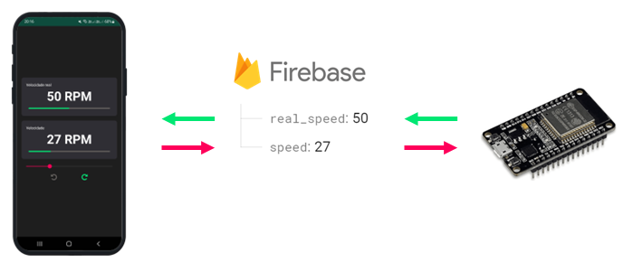

# Controle de velocidade de motor CC

<!-- centralize image -->

    

> Este é um software de código aberto que visa controlar o sentido de rotação e velocidade em RPM de um motor CC.

## Fluxo de dados

O fluxo de dados consiste em trafegar a informação da velocidade desejada enviando-a do aplicativo para o ESP32 e a velocidade real do ESP32 (obtida através da leitura do encoder do motor).

## 📝 Licença

Esse projeto está sob licença. Veja o arquivo [LICENÇA](LICENSE) para mais detalhes.

[⬆ Voltar ao topo](#controle-de-velocidade-de-motor-cc)